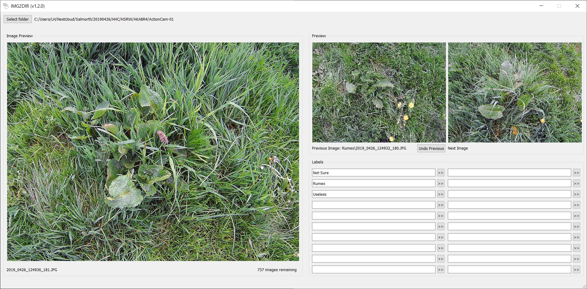

# IMG2DIR (Image to Directory)
IMG2DIR (“Image to Directory”) is an open source software written in Python 3 that allows users to assign images to sub-directories while previewing the images, by simply clicking buttons. And was originally designed to assist the image labeling process before training a convolutional neural network for image classification task.

# Functionality
IMG2DIR consists of the following features:

*	Assign labels by moving the image to a sub-directory (name of the sub-directory can be used as a label in the future)
* Select folder with images, display the selected folder name, the first and second images, and previous processed image if exists.
* Load the labels by scanning the first level of sub-directories within the selected folder.
* Input new label to automatically create corresponding sub-directory.
* Support up to 20 labels.
* Re-do function as long as the user have not selected new directory to process
* Display the number of remaining images, the current image name and the previous processed image name if exists

# Acknowledgement
The software IMG2DIR is a by-product developed in the SPECTORS Project, a Dutch-German cooperation project funded by INTERREG V-A Deutschland-Nederland (project number 143081).

# License
© Copyright 2019, Olee Hoi Ying Lam. License under [GNU GPLv3](https://github.com/oleelamhy/IMG2DIR/blob/master/LICENSE).
